<p align="center">
  <a href="https://gobirdieapp.com">
    
  </a>
</p>

# GoBirdie Anchor

[](https://github.com/GoBirdieApp/GoBirdie_Anchor/actions/workflows/ci.yml)

**Physics-backed club profile generation for GoBirdie.**

GoBirdie Anchor converts a player's known club distances/partial data and handicap into a launch-monitor-style bag profile.
For each selected club, it estimates internally consistent ball speed, launch angle, spin, apex, landing angle, and related shot data using calibrated golf-ball flight logic.

This repository contains the public evaluation version of the Anchor pipeline. It is used when a player has stock carry distances but does not have a complete launch monitor session.

---

## Problem

Golfers know their usual carry distances. Far fewer have reliable launch monitor numbers for every club in the bag.

GoBirdie Anchor fills that gap by:

1. Personalizing reference tour and LPGA anchor profiles to the player's carry distances
2. Solving launch conditions that reproduce the requested carry within realistic club-specific bands
3. Validating physical feasibility so questionable inputs are surfaced as low-confidence estimates
4. Exporting a complete bag profile that downstream GoBirdie systems can treat consistently with measured data

The output is not intended to replace measured launch monitor data. It provides a transparent, physics-informed estimate when measured data is missing or incomplete.

---

## Model Scope

Anchor is built as a practical production scaffold for GoBirdie's MVP path.
It aims to generate reliable, internally consistent club profiles without trying to model every small variable that can influence a real golf shot.

The current model intentionally focuses on the variables that matter most for the product experience: carry distance, handicap, launch conditions, spin, apex, landing angle, and feasibility.
Course conditions, ball model differences, strike variability, player delivery, weather, and equipment-specific effects can all be refined as GoBirdie collects more measured data.

In other words, Anchor is designed to be useful now and improve over time. The goal is not perfect physical reconstruction on day one; it is a trustworthy estimation foundation that can evolve with the GoBirdie data pipeline.

---

## Architecture



| Layer               | Role                                                                                                        |
| ------------------- | ----------------------------------------------------------------------------------------------------------- |
| `carry_onlyGate/`   | Carry-distance-only estimation path using LPGA-to-PGA anchor blending, handicap shaping, and launch solving |
| `partial_dataGate/` | Partial launch monitor reconciliation when a player provides some measured fields                           |
| `src/physics/`      | Point-mass RK4 ball-flight simulation with calibrated drag, lift, and spin decay                            |
| `src/estimation/`   | Input validation and feasibility checks for player-supplied shot claims                                     |
| `src/anchor/`       | Profile assembly, confidence scoring, and measured/estimated source handling                                |
| `src/pipeline/`     | Full-bag orchestration and Trackman-screen export payload generation                                        |

---

## Quick Start

```bash
git clone https://github.com/GoBirdieApp/GoBirdie_Anchor.git
cd GoBirdie_Anchor
npm install
npm test
```

```ts
import { runAnchorPipeline } from '@gobirdie/anchor';

const result = runAnchorPipeline({
  selectedClubIds: ['Driver', '7-iron', 'P-Wedge'],
  hasTrackmanData: false,
  player: {
    handicap: 12,
    clubDistancesM: {
      Driver: 230 * 0.9144,
      '7-iron': 155 * 0.9144,
      'P-Wedge': 115 * 0.9144,
    },
  },
});

console.log(result.profiles['7-iron']);
```

Example profile shape:

```ts
{
  clubId: "7-iron",
  carryM: 141.7,
  ballSpeedMs: 48.9,
  launchAngleDeg: 19.5,
  spinRPM: 5782,
  maxHeightM: 20.5,
  landingAngleDeg: 41.5,
  confidence: 0.35,
  lowConfidence: true,
  source: "carry_only"
}
```

---

## Public API

The package entrypoint exports the pipeline, validation utilities, physics helpers, core types, and constants:

```ts
import {
  runAnchorPipeline,
  runAnchorPipelineStrict,
  validateShotFeasibility,
  simulateFlight,
  TRACKMAN_CLUB_IDS,
  type AnchorPipelineInput,
  type AnchorPipelineResult,
} from '@gobirdie/anchor';
```

Use `runAnchorPipeline` for tolerant profile generation. It returns profiles where possible and marks questionable estimates through confidence and feasibility metadata.

Use `runAnchorPipelineStrict` when invalid or physically infeasible estimated inputs should throw.

---

## Project Layout

```text
GoBirdie_Anchor/
├── carry_onlyGate/
│   ├── Default_Method.ts
│   ├── anchorBlend.ts
│   └── README.md
├── partial_dataGate/
│   ├── Partial_Method.ts
│   ├── reconcile.ts
│   └── README.md
├── src/
│   ├── anchor/
│   ├── constants/
│   ├── estimation/
│   ├── export/
│   ├── methods/
│   ├── physics/
│   ├── pipeline/
│   ├── types/
│   └── utils/
├── docs/assets/
├── sandbox/
├── scripts/
├── .github/workflows/
├── package.json
└── tsconfig.json
```

---

## Scripts

| Command               | Description                                    |
| --------------------- | ---------------------------------------------- |
| `npm run build`       | Compile TypeScript to `dist/`                  |
| `npm run typecheck`   | Type-check without emitting build output       |
| `npm test`            | Run the Vitest suite                           |
| `npm run ci`          | Run typecheck, tests, and build                |
| `npm run sandbox:dev` | Start the local sandbox UI                     |
| `npm run sandbox:cli` | Run the sandbox pipeline from the command line |

Requirements: Node.js 20+ and npm 10+.

---

## Validation

Anchor is designed to fail visibly when input data is not plausible. Estimated profiles include:

- Field-count validation for partial launch monitor inputs
- Carry feasibility checks against club-specific launch and spin bands
- Physics-based consistency checks for carry, apex, and landing angle
- Confidence scoring and `lowConfidence` markers for downstream UI handling

The current local test suite covers carry-only gate behavior, partial-data reconciliation, feasibility validation, calibration bounds, and physics integrator behavior.

---

## License

Copyright (c) 2026 GoBirdie. All rights reserved.

This source is published for transparency and evaluation. Redistribution, commercial use, or incorporation into other products requires prior written permission from GoBirdie. See [LICENSE](LICENSE).

---

## Links

- [GoBirdie](https://gobirdieapp.com)
- [Repository](https://github.com/GoBirdieApp/GoBirdie_Anchor)
- [Contact](mailto:contact@GoBirdieApp.com)
- [Developer](https://github.com/OttoM1)
